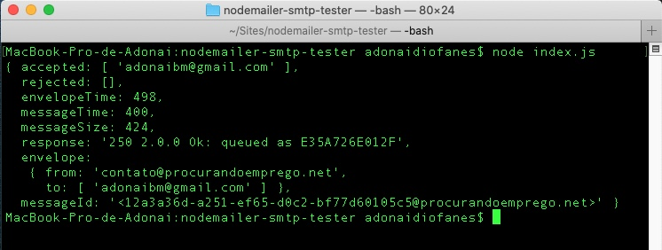

# NODE MAILER SMTP TESTER
## (pt-br version)

Uma ferramenta simples que te ajuda a como testar o funcionamento de SMTP em um servidor [Node.js](https://nodejs.org/).

## Requisitos
1. node (>8.9.4)
2. npm

## Como rodar o projeto?
1. Vamos instalar as dependências do arquivo `package.json` rodando o seguinte comando em nosso terminal: `npm install`

2. Copie o arquivo `.env.example` para um novo arquivo chamado `.env` e altere as configurações de acordo com o seu servidor de SMTP.

3.  Após realizar as configurações necessárias, basta rodar no terminal: node index.js

## Resultado

---

## (en version)

A simple tool to test whether SMTP is working on the server.

## Requisites
1. node (>8.9.4)
2. npm

# How to run the project?

1. We will install the dependencies of the `package.json` file by running the following command in our terminal:` npm install`

2. Copy the `.env.example` file to a new file named ` .env` and change the settings according to your SMTP server.

3. After apply the necessary settings, just run in the terminal: `node index.js`

## Result

